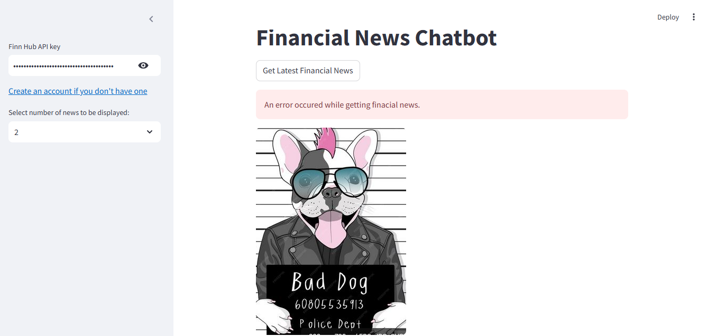

# Financial News Chatbot

This is a simple **Streamlit-based** chatbot application that fetches the latest financial news using the **Finnhub API**. The app allows users to input their **Finnhub API key** and retrieve financial news articles. The app is designed to be a tool for users to stay updated with the latest happenings in the financial world.

## Features

- Fetches **real-time financial news** using **Finnhub API**.
- Allows users to input their **Finnhub API key** and select the number of news articles they want to view.
- Provides error handling if the API fails or invalid credentials are provided.
- Displays the **news headline**, **summary**, and a link to the full article.

## Requirements

To run the application locally, you will need to install the following dependencies:

- **Streamlit** - For building the interactive web app.
- **Finnhub** - For fetching financial data.

### Install Dependencies

To install the required libraries, use the following command:

``bash
pip install -r requirements.txt

### Running the Application

Follow these steps to run the application:

Clone the repository to your local machine:

    git clone https://github.com/your-username/financial-news-chatbot.git

Navigate into the project folder:
 
    cd financial-news-chatbot

Run the app using Streamlit:

    streamlit run app.py

Once the app launches, enter your Finnhub API key (you can get one by registering on Finnhub) and select how many articles you'd like to display.

Press the "Get Latest Financial News" button to retrieve the news articles.

## Example Usage

    When you run the app, it will ask for a Finnhub API key and the number of news articles you want to view. After entering the details, click on "Get Latest Financial News," and the app will fetch and display the news articles.

## Screenshot
 

 

## License

  This project is open-source under the MIT License.
  
## Disclaimer

  This is a learning project developed for educational purposes. The app uses the Finnhub API to fetch financial news, and the API key provided by the user is used for access.